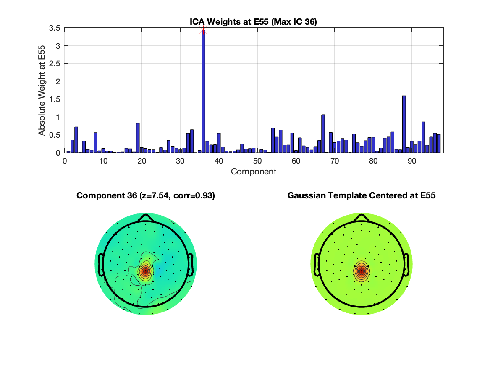

# E55 Artifact Detector

This repository contains a MATLAB function to detect unusual artifacts affecting electrode **E55** in EEG data acquired from EGI nets. The function leverages ICA weights to perform a binary classification, flagging files that display excessive activity at **E55**. It assumes that an ICA decomposition has been performed on your EEG data (e.g., via EEGLAB).

## Features

- **Binary Classifier:** Flags an EEG file if the maximum z-score of the absolute ICA weights at **E55** exceeds a specified threshold.
- **Spatial Correlation:** Compares the topography of the flagged component to a Gaussian template centered on **E55**.
- **Visualization:** Generates a figure with a bar plot of ICA weights and topographical maps for both the excessive component and the Gaussian template.
- **Customizable Threshold:** Default threshold is 5, but can be adjusted as needed.
- **Output:** Saves a figure file and returns a detailed table summarizing the results.



## Usage

1. **Prerequisites:**
   - MATLAB
   - EEGLAB (for EEG structure and topoplot function)

2. **Function Call:**

   ```matlab
   resultTable = detectE55ArtifactV2(EEG); % Uses default threshold of 5 and current folder for output
   ```

   To specify a custom threshold and output directory:

   ```matlab
   resultTable = detectE55ArtifactV2(EEG, 6, 'C:\MyOutputDirectory');
   ```

3. **Inputs:**
   - `EEG`: An EEGLAB structure that must include fields `chanlocs`, `icawinv`, and `filename`.
   - `threshold`: (Optional) A cutoff for the maximum z-score (default = 5).
   - `outDir`: (Optional) Directory for saving the generated figure (default = current directory).

4. **Outputs:**
   - A MATLAB table containing:
     - Filename
     - Binary classifier result
     - Maximum z-score
     - Index of the maximum ICA component
     - Cutoff threshold
     - Template matching correlation
     - Path to the saved figure file

## Example

Here is a simple example of how to use the function:

```matlab
% Load your EEG data with precomputed ICA weights
EEG = pop_loadset('filename', 'subject01.set', 'filepath', 'C:\EEGData');

% Detect the E55 artifact
result = detectE55ArtifactV2(EEG, 5, 'C:\ArtifactFigures');

% Display the result
disp(result);
```

## Contributing

Contributions are welcome! Please fork the repository and submit a pull request with your improvements or bug fixes.

## License

This project is licensed under the MIT License.
